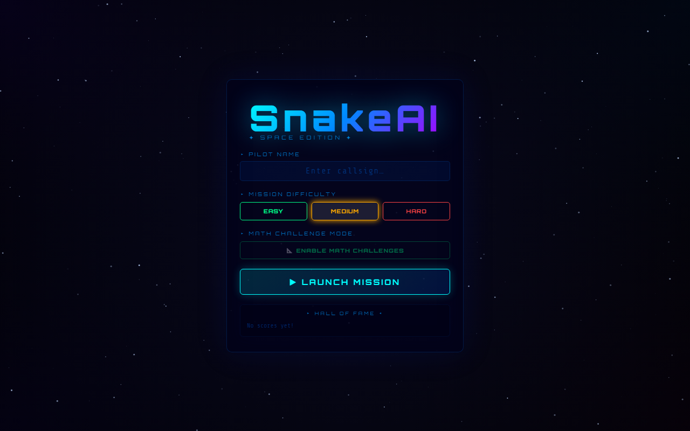
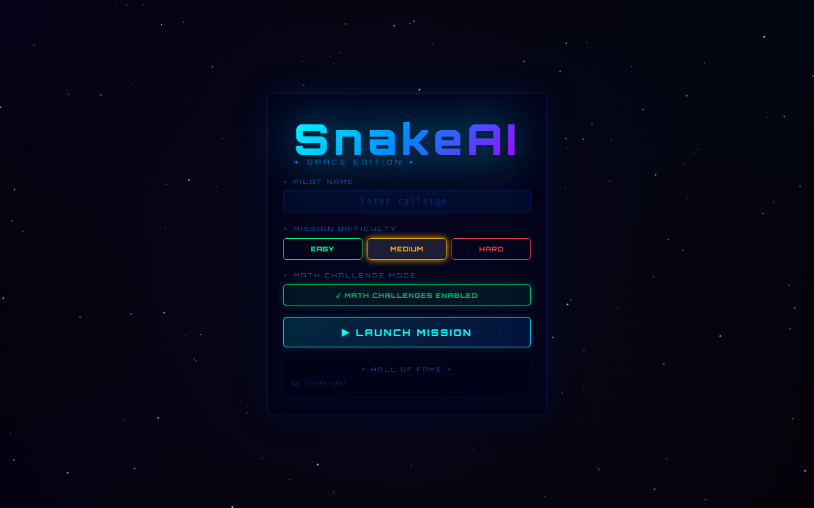
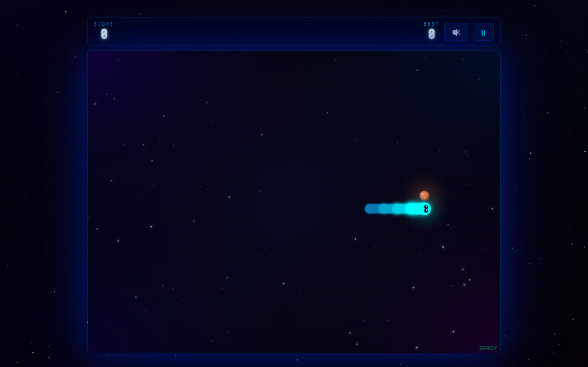
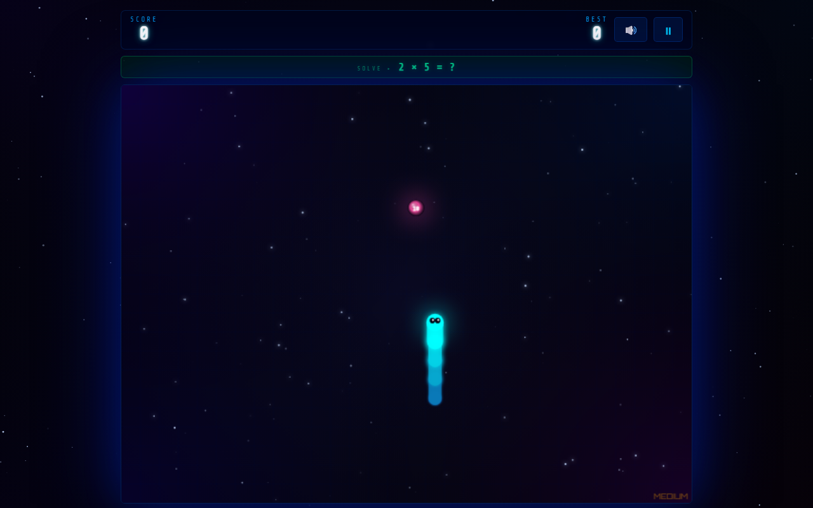
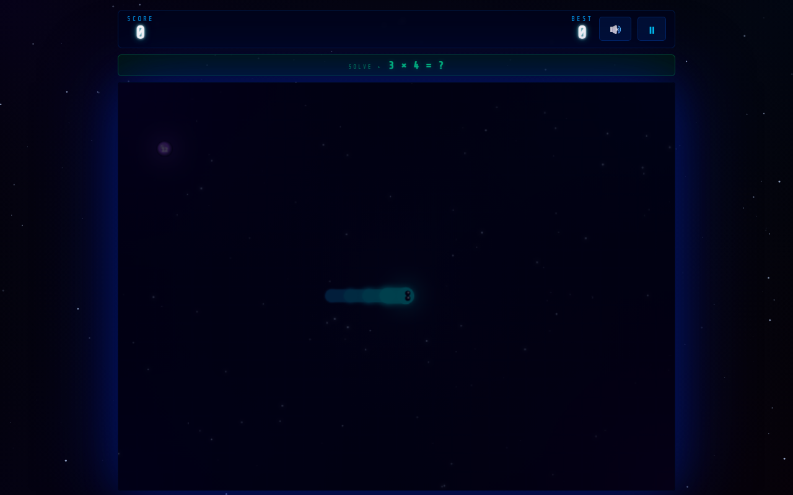
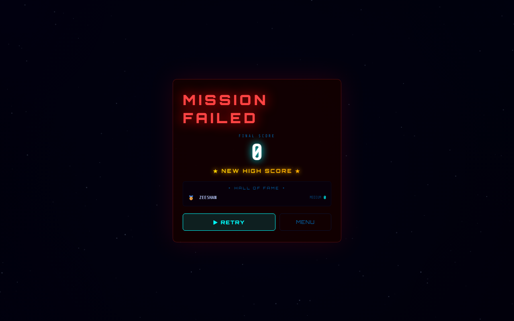
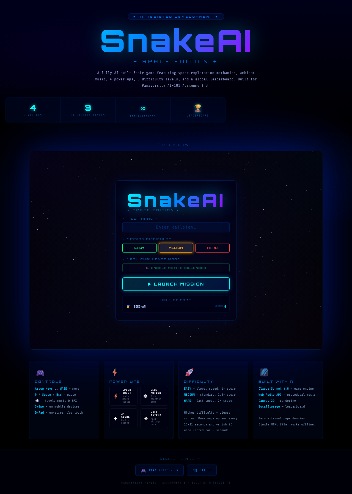

<div align="center">

# 🚀 SnakeAI — Space Edition

### Panaversity AI-101 · Assignment 2 · Development Report

[](https://github.com/ZeeshanKolachi/neon-snake)
[](https://neon-snake-pi-ten.vercel.app/play.html)
[](https://claude.ai)

**Student:** Zeeshan Ahmed Kolachi &nbsp;|&nbsp; **Date:** June 2026 &nbsp;|&nbsp; **AI Tool:** Claude Sonnet 4.6

[🎮 Play Live](https://neon-snake-pi-ten.vercel.app/play.html) &nbsp;·&nbsp; [⌨ GitHub Repo](https://github.com/ZeeshanKolachi/neon-snake) &nbsp;·&nbsp; [📄 HTML Report](report.html)

</div>

---

## 📋 Table of Contents

1. [Project Title](#1-project-title)
2. [App / Game Idea](#2-app--game-idea)
3. [Purpose of the Project](#3-purpose-of-the-project)
4. [AI Tools Used](#4-ai-tools-used)
5. [Initial Prompt](#5-initial-prompt)
6. [Prompt Iterations](#6-prompt-iterations)
7. [What Worked Well](#7-what-worked-well)
8. [What Did Not Work](#8-what-did-not-work)
9. [Bugs & Challenges](#9-bugs--challenges)
10. [How Issues Were Solved](#10-how-issues-were-solved)
11. [Features Added or Improved](#11-features-added-or-improved)
12. [Final Result](#12-final-result)
13. [Real-World Problem Solved](#13-real-world-problem-solved)
- [📸 Screenshots Gallery](#-screenshots-gallery)
- [📦 Version History](#-version-history)
- [⚡ Quick Start](#-quick-start)

---

## ⚡ Quick Start

```bash
git clone https://github.com/ZeeshanKolachi/neon-snake.git
start index.html   # Windows — no build step required
```

> **Zero dependencies.** No `npm install`, no server. Open `index.html` in any modern browser.

---

## 1. Project Title

# SnakeAI — Space Edition

> A fully AI-built Snake game with space theme, procedural music, 4 power-ups, 3 difficulty levels, persistent leaderboard, and Math Challenge Mode.

**Final Version:** v1.4.3 &nbsp;|&nbsp; **Stack:** Vanilla JS + Canvas 2D + Web Audio API &nbsp;|&nbsp; **Size:** ~46 KB

---

## 2. App / Game Idea

A modern reimagining of classic Snake with a **Space Galaxy theme**. The player controls a glowing comet-trail snake on an animated starfield canvas, collecting glowing planets while avoiding walls. The optional **📐 Math Challenge Mode** overlays arithmetic questions onto the game — each food planet displays the answer to a question shown in the HUD.

| Feature | Highlights |
|---|---|
| 🎨 Visual | Animated starfield, nebula corners, planet food, comet snake with gradient trail |
| ⚡ Power-Ups | Speed Boost, Slow Motion, 2× Score, Wall Shield |
| 🏆 Progression | 3 difficulty levels, localStorage leaderboard, new-high-score badge |
| 📐 Education | Math Challenge Mode — arithmetic drill through gameplay |
| 📱 Platform | Desktop + mobile (D-pad + swipe), any modern browser, works offline |

---

## 3. Purpose of the Project

Demonstrate **AI-assisted development** by building a polished game entirely from natural language prompts.

**Goals:**
- Practice prompt engineering through multiple iterations
- Learn Canvas 2D, Web Audio API, and localStorage without a framework
- Build something visually engaging and genuinely replayable
- Show real-world educational value through Math Challenge Mode

> 💡 The entire game is a **single `index.html` file** (~46 KB, unminified) with zero external dependencies beyond Google Fonts.

---

## 4. AI Tools Used

| Tool | Model | Role |
|---|---|---|
| **Claude Code CLI** | Claude Sonnet 4.6 | All code generation, bug fixing, feature additions, testing |
| GitHub Copilot | — | Occasional inline suggestions during editing |

Every git commit includes `Co-Authored-By: Claude Sonnet 4.6`.

---

## 5. Initial Prompt

```
Build me a complete Snake game in a single HTML file using vanilla JavaScript and Canvas 2D.
Theme: Neon Cyberpunk. Dark background with neon green snake.
Features: three food types (+5/+15/+50 pts), diamond power mode, 5 speed levels,
combo multiplier, animated starfield, Web Audio SFX, localStorage high score,
Arrow keys + WASD. No external dependencies except Google Fonts.
```

**Result:** Commit `7f73f31` — working single-file Snake game with combo multiplier, procedural SFX, and high score persistence.

---

## 6. Prompt Iterations

<details>
<summary><strong>Iteration 2 — Bug Fixes (v2.0 / v2.1)</strong></summary>

Fixes requested: 180° reversal on rapid keypresses, power bar persisting between games, fruit speed boost not applied, particle FPS drop, Space/R keyboard shortcuts.

**Result:** Direction queue (prevents instant reversal), `initGame()` cleanup, particle cap at 250, keyboard shortcuts.
</details>

<details>
<summary><strong>Iteration 3 — 10 New Features (v3.0)</strong></summary>

Requested: 4 new power-ups (Shield/Magnet/Slow-Mo/Ghost), portal wall mode, x2/x3/x5 combo, mobile D-pad + touch swipe, session stats.

**Result:** All 10 features added in one pass.
</details>

<details>
<summary><strong>Iteration 4 — Remove Self-Collision (v3.1)</strong></summary>

Requested: Remove self-collision — only wall boundary kills the snake. Repurpose Ghost as wall-immunity pickup.

**Result:** Self-collision removed, Ghost reworked.
</details>

<details>
<summary><strong>Iteration 5 — Ambient Music & Modal (v3.2)</strong></summary>

Requested: Procedural ambient space music via Web Audio API (no audio files). Animated Game Over modal with glitch title.

**Result:** 3 LFO drones + Am chord pad. Animated modal with bounce entrance.
</details>

<details>
<summary><strong>Iteration 6 — Space Edition Rebuild (v4.0)</strong></summary>

Requested: Complete visual and architectural rebuild. Space Galaxy theme: starfield, nebula, planet food, comet snake. 3 difficulty levels, top-10 leaderboard, 4 power-ups, 3-2-1-GO countdown, player name input.

**Result:** Current SnakeAI Space Edition architecture (commit `825bee6`).
</details>

<details>
<summary><strong>Iteration 7 — Visual Polish (v4.1)</strong></summary>

Requested: Brighter canvas, stronger glow, larger planets, frosted glass HUD, transparent Game Over screen.

**Result:** Commit `a62aba8` — all improvements applied.
</details>

<details>
<summary><strong>Iteration 8 — Phase 1 Bug Fixes</strong></summary>

Fixed: Shield HUD bar stuck at 100%, self-collision regression, Retry skipping scaleCanvas(), wrong GitHub link in play.html.
</details>

<details>
<summary><strong>Iteration 9 — Math Mode + How to Play (v1.4.1)</strong></summary>

Requested: Optional Math Challenge Mode toggle — question in HUD bar, answer on planet, toast confirms equation. How to Play modal accessible from start screen and HUD.

**Result:** Full Math Mode implementation + modal with controls, scoring, power-ups, tips.
</details>

---

## 7. What Worked Well

- **Single-file architecture** — fast iteration, no build step, instant browser feedback
- **Canvas 2D rendering** — gradient fills, radial glows, shadow effects correct on first attempt
- **Procedural audio** — LFO drone ambient music creates genuine atmosphere without audio files
- **Iterative prompting** — each prompt built cleanly on the last without losing prior work
- **Direction queue** — correctly prevents 180° reversal race condition
- **localStorage leaderboard** — JSON serialization, XSS escaping, top-10 capping all solid
- **Responsive canvas** — `scaleCanvas()` + CSS flexbox works across all screen sizes

---

## 8. What Did Not Work

- **180° reversal** — initial fix still checked `dir` not queued `ndir`; needed a second prompt
- **Power bar persistence** — HUD bar state leaked between game sessions
- **Self-collision regression** — v3.1 removed it; v4.0 full rebuild accidentally re-added it
- **Automated screenshots** — Playwright moved snake into walls immediately (score 0); required multiple attempts
- **Shield timer UX** — one-use shield showed 100% timer bar permanently; needed explicit "1 USE" label fix

---

## 9. Bugs & Challenges

| # | Bug | Severity | Status |
|---|-----|:---:|:---:|
| 1 | Snake reverses 180° on rapid keypresses → instant death | 🔴 Critical | ✅ Fixed |
| 2 | Power/boost bar persists after game restart | 🟠 High | ✅ Fixed |
| 3 | Fruit speed boost defined but never applied | 🟠 High | ✅ Fixed |
| 4 | Unlimited particles cause FPS drop at long snake lengths | 🟠 High | ✅ Fixed |
| 5 | `spawnFood()` infinite-loop if grid completely full | 🟡 Medium | ✅ Fixed |
| 6 | Self-collision re-introduced in v4 rebuild (regression) | 🟡 Medium | ✅ Fixed |
| 7 | Wall Shield HUD timer frozen at 100% | 🟢 Low | ✅ Fixed |
| 8 | Retry skips `scaleCanvas()` after window resize | 🟢 Low | ✅ Fixed |
| 9 | play.html GitHub link points to profile, not repo | 🟢 Low | ✅ Fixed |
| 10 | AudioContext blocked by browser autoplay policy | 🟢 Low | ✅ Fixed |

---

## 10. How Issues Were Solved

**Bug 1 — 180° Reversal:** Replaced direction check with a **direction queue** (max 2). Inputs are accepted only if they don't oppose the last *queued* direction.

**Bug 2 — State Persistence:** Added explicit resets in `initGame()`: clear power bar, reset fill widths, hide HUD elements.

**Bug 3 — Fruit Speed Boost:** Made `getMs()` read both active power-up state and fruit boost flag simultaneously.

**Bug 4 — Particle FPS Drop:** Capped particle list at **180 max**; limited sparkle emission to head + 4 segments only.

**Bug 5 — Infinite Loop:** Added null-guard in `spawnFood()` — returns null if grid is full.

**Bug 6 — Self-Collision Regression:** Removed `snake.some()` check re-introduced in v4. Wall boundary only.

**Bug 7 — Shield HUD:** `showPuHud()` detects SHIELD type → shows `"1 USE"` label instead of timer bar.

**Bug 8 — Retry Canvas Scale:** Added `scaleCanvas()` call in retry button listener.

**Bug 9 — GitHub Link:** Updated href from profile URL to `github.com/ZeeshanKolachi/neon-snake`.

**Bug 10 — AudioContext:** `audio.init()` called only inside click handlers (after confirmed user gesture).

---

## 11. Features Added or Improved

### 🎨 Visual System
- Two-layer animated starfield (220 bg + 120 in-game stars)
- 4-corner nebula gradients in game canvas
- Planet food with radial gradient, specular highlight, orbital ring
- Snake: comet trail with RGB gradient, rounded connectors, glowing eyes, shield pulse ring
- Particle explosions: 18 per food collect, 60 dual-colour on game over
- Canvas auto-scales to viewport on load, resize, and retry

### ⚡ Power-Ups

| Icon | Name | Effect | Duration |
|:---:|---|---|:---:|
| ⚡ | Speed Boost | Move interval × 0.52 | 5 sec |
| ❄ | Slow Motion | Move interval × 1.85 | 6 sec |
| ✦ | 2× Score | All points doubled | 8 sec |
| ◈ | Wall Shield | Next wall hit wraps snake | 1 use |

Spawn every 13–21s. Vanish after 9s uncollected. Orbital dot + shrinking timer arc.

### 🏆 Core Gameplay
- 3 difficulty levels: Easy (170ms, ×1.0) · Medium (115ms, ×1.5) · Hard (72ms, ×2.0)
- 3-2-1-GO! countdown · Pause (P/Space/Esc) · Mute toggle
- Player callsign input → persisted to top-10 localStorage leaderboard
- "★ NEW HIGH SCORE ★" badge on leaderboard top

### 🎵 Audio
- **Ambient:** 3 LFO drones (55/82/110 Hz) + Am chord pad — pure Web Audio, zero files
- **SFX:** eat (frequency sweep) · power-up (arpeggio) · expire (descending) · game over (sawtooth)

### 📐 Math Challenge Mode *(v1.4.1)*
- Toggle on start screen (zero impact when off)
- Green HUD bar: `SOLVE ▸ 7 × 8 = ?`
- Answer shown as text on planet surface
- Toast confirms equation on eat: `✓ 7 × 8 = 56`
- Scaled: addition (Easy) · multiplication (Medium/Hard)

### ❓ How to Play *(v1.4.2)*
- `❓ HOW TO PLAY` on start screen · `❓` in HUD auto-pauses
- Sections: Objective, Controls, Scoring, Power-ups, Math Mode, Pro Tips

### 📱 Mobile
- D-pad auto-shown when `innerWidth < 700` or mobile UA
- Canvas touch swipe (8px threshold)
- Responsive scaling with `clamp()` fonts

---

## 12. Final Result

> ✅ Polished browser Snake game — deployed on Vercel, works on desktop and mobile, loads from a single HTML file.

### Technical Specs

| Attribute | Value |
|---|---|
| Files | 2 (`index.html` game · `play.html` landing page) |
| Size | ~46 KB unminified |
| Dependencies | Google Fonts only |
| Browser Support | Chrome, Firefox, Edge, Safari |
| Mobile | ✅ D-pad + swipe |
| Offline | ✅ After first load |
| Audio | Procedural (zero audio files) |
| Storage | localStorage leaderboard (~1 KB) |
| Framework | None — vanilla JS + Canvas 2D |

### Development Stats

| Metric | Value |
|---|---|
| Git commits | 13 |
| Major versions | 4 |
| Bugs fixed | 10+ |
| Prompt iterations | 9 |
| Lines of code | ~1,100 |
| AI tool | Claude Sonnet 4.6 (Claude Code CLI) |

### 🔗 Links

| | URL |
|---|---|
| 🎮 Live Game | https://neon-snake-pi-ten.vercel.app |
| 🌐 Landing Page | https://neon-snake-pi-ten.vercel.app/play.html |
| ⌨ GitHub | https://github.com/ZeeshanKolachi/neon-snake |
| 📄 HTML Report | [report.html](report.html) |

---

## 13. Real-World Problem Solved

> **Problem:** Students find arithmetic drills boring and disengage from repetitive worksheet practice, reducing retention of fundamental math facts.

### Solution: Math Challenge Mode

The Math Challenge Mode turns the game into a **gamified math facts drill**. Each time the snake eats a planet, a new arithmetic question is answered. The game loop (eat → score → grow → eat) creates a motivating cycle.

| Benefit | Detail |
|---|---|
| 🎯 Engagement | Students play voluntarily — more practice per session |
| 🔄 Variety | Random question generation, no repetition |
| 📈 Scaling | Easy = addition (7–9 yrs) · Medium/Hard = multiplication (9–12 yrs) |
| ✅ Feedback | Instant toast confirms full equation on every collect |
| 🌐 Zero Friction | Browser link → play → learn; no login, no install |
| 💸 Free | Open source, no ads, no tracking |

**Target users:** Primary school students (7–12), teachers, parents seeking productive screen-time.

---

## 📸 Screenshots Gallery

<table>
  <tr>
    <td align="center"><strong>Start Screen</strong></td>
    <td align="center"><strong>Math Mode Enabled</strong></td>
  </tr>
  <tr>
    <td></td>
    <td></td>
  </tr>
  <tr>
    <td align="center"><strong>Live Gameplay</strong></td>
    <td align="center"><strong>Math Mode in Action</strong></td>
  </tr>
  <tr>
    <td></td>
    <td></td>
  </tr>
  <tr>
    <td align="center"><strong>Countdown Screen</strong></td>
    <td align="center"><strong>Mission Failed</strong></td>
  </tr>
  <tr>
    <td></td>
    <td></td>
  </tr>
  <tr>
    <td colspan="2" align="center"><strong>play.html Landing Page</strong></td>
  </tr>
  <tr>
    <td colspan="2" align="center"></td>
  </tr>
</table>

---

## 📦 Version History

| Version | Commit | Highlights |
|---|---|---|
| **v1.4.3** ✅ Final | `fe73a3f` | REPORT.md, README.md, gameplay video, all corrections, final submission |
| **v1.4.2** | `38a7f2f` | Name & assignment corrections, How to Play modal, play.html guide |
| **v1.4.1** | `53f5183` | Math Challenge Mode, Shield fix, self-collision removed, screenshots |
| **v1.4.0** | `a62aba8` | Visual polish — brighter starfield, stronger glow, frosted HUD |
| **v1.3.0** | `825bee6` | Complete Space Edition rebuild — planet food, comet snake, leaderboard |
| **v1.2.2** | `1dd91dc` | Procedural ambient music, animated Game Over modal |
| **v1.2.1** | `1f73e2f` | Remove self-collision, rework Ghost as wall-immunity |
| **v1.2.0** | `de3a37a` | 10 new features — 4 power-ups, mobile D-pad, x5 combo |
| **v1.1.0** | `8ef12b0` | Critical bug fixes — direction queue, particle cap, fruit boost |
| **v1.0.0** | `7f73f31` | Initial Neon Snake Cyberpunk Edition |

---

<div align="center">

**Panaversity AI-101 · Assignment 2 · Zeeshan Ahmed Kolachi · June 2026**
Built with [Claude Sonnet 4.6](https://claude.ai) via Claude Code CLI · Deployed on [Vercel](https://vercel.com)

</div>
